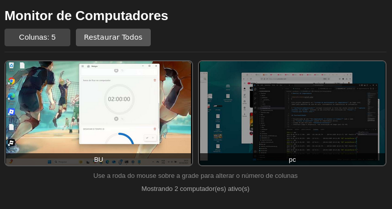

# Sistema de Monitoramento de Telas em Tempo Real

<div align="center">


**Solução robusta e segura para monitoramento educacional com criptografia de ponta a ponta**

[Funcionalidades](#-funcionalidades) • [Instalação](#-instalação-e-configuração) • [Como Usar](#-como-executar) • [Arquitetura](#-arquitetura) • [Testes](#-testes)

</div>

---

## Sobre o Projeto

Sistema cliente-servidor desenvolvido para monitoramento em tempo real de telas de computadores em ambientes educacionais. Projetado especialmente para laboratórios de informática, salas de aula e cenários de treinamento onde instrutores precisam acompanhar a atividade dos participantes.

### Diferenciais

- **Segurança Avançada**: Criptografia de ponta a ponta com protocolo CURVE
- **Alta Performance**: Comunicação otimizada com compressão de imagens e baixa latência
- **Interface Moderna**: Painel web responsivo com atualização em tempo real
- **Escalável**: Suporte para múltiplos clientes simultâneos
- **Fácil Configuração**: Gerenciamento centralizado via arquivo `.env`

## Funcionalidades

- Visualização simultânea de múltiplas telas de alunos
- Atualização automática do painel web
- Sistema de detecção de status (online/inativo)
- Compressão inteligente de imagens
- Reconexão automática de clientes
- Logs detalhados para monitoramento e debug
- Interface responsiva e intuitiva

## Preview

<div align="center">
  
  <p><em>Interface do painel de monitoramento</em></p>
</div>

## Tecnologias

| Categoria | Tecnologia |
|-----------|-----------|
| **Backend** | Python 3.8+ |
| **Web Server** | Flask + Hypercorn |
| **Captura de Tela** | mss |
| **Processamento** | Pillow |
| **Configuração** | python-dotenv |

```ini
# --- Cliente (aluno.py) ---
INTERVALO_CAPTURA=5
QUALIDADE_IMAGEM=60
TAMANHO_MAX=800
SERVIDOR_IP=127.0.0.1
SERVIDOR_PORTA_ZMQ=5555
```

#### 5. Gere os certificados de segurança

```bash
python generate_certificates.py
```

> **Importante**: Execute este comando apenas uma vez. Os certificados gerados são essenciais para a comunicação criptografada.

O servidor estará disponível em:
- Interface Web: `http://127.0.0.1:5000`
- Socket: `tcp://127.0.0.1:5555`

### Fluxo de Dados

```
┌─────────────┐         ┌──────────────┐         ┌─────────────┐
│   Cliente   │────────▶│              │────────▶│  Servidor   │
│   (Aluno)   │  CURVE  │  (ROUTER)    │         │ (Professor) │
└─────────────┘         └──────────────┘         └─────────────┘
      │                                                  │
      │ Captura                                          │
      │                                                  │
      │                                           Atualiza Estado
      │                                                  │
      │                                                  ▼
      │                                           ┌─────────────┐
      │                                           │   Flask     │
      │                                           │  (Web UI)   │
      │                                           └─────────────┘
      │                                                  │
      │                                                  ▼
      │                                           ┌─────────────┐
      └───────────────────────────────────────────│  Navegador  │
                                                  └─────────────┘
```


## Segurança

- **Criptografia CURVE**: Baseada em criptografia de curva elíptica (Curve25519)
- **Autenticação**: Apenas clientes com certificados válidos podem se conectar
- **Isolamento**: Comunicação ponto a ponto sem intermediários
- **Integridade**: Verificação automática de integridade das mensagens

## Licença

Este projeto está licenciado sob a **Licença MIT** - veja o arquivo [LICENSE](LICENSE) para detalhes.

```
MIT License

Copyright (c) 2025 Marcus Silva

Permission is hereby granted, free of charge, to any person obtaining a copy
of this software and associated documentation files (the "Software"), to deal
in the Software without restriction, including without limitation the rights
to use, copy, modify, merge, publish, distribute, sublicense, and/or sell
copies of the Software, and to permit persons to whom the Software is
furnished to do so, subject to the following conditions:

The above copyright notice and this permission notice shall be included in
all copies or substantial portions of the Software.

THE SOFTWARE IS PROVIDED "AS IS", WITHOUT WARRANTY OF ANY KIND, EXPRESS OR
IMPLIED, INCLUDING BUT NOT LIMITED TO THE WARRANTIES OF MERCHANTABILITY,
FITNESS FOR A PARTICULAR PURPOSE AND NONINFRINGEMENT. IN NO EVENT SHALL THE
AUTHORS OR COPYRIGHT HOLDERS BE LIABLE FOR ANY CLAIM, DAMAGES OR OTHER
LIABILITY, WHETHER IN AN ACTION OF CONTRACT, TORT OR OTHERWISE, ARISING FROM,
OUT OF OR IN CONNECTION WITH THE SOFTWARE OR THE USE OR OTHER DEALINGS IN
THE SOFTWARE.
```

## Autor

**Marcus Silva**

- Site: [Do.Not.com](https://do.not.com)

## Agradecimentos

- Comunidade ZeroMQ pela excelente biblioteca
- Projeto Flask pela simplicidade e eficiência
- Todos os contribuidores

⭐ **Se este projeto foi útil, considere dar uma estrela!** ⭐

